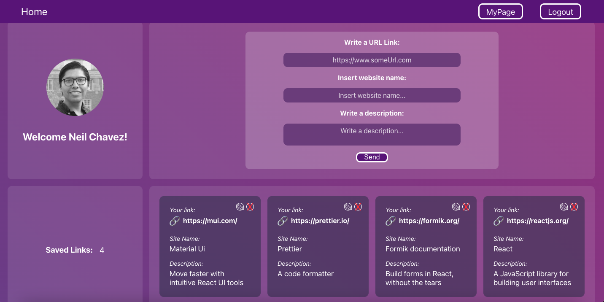

# Save the Links

In this application the user can save the links of the websites that interest him. 
The user can subsequently check his own Links and, if he wishes, he can modify and/or remove them.

I use Firebase to manage users and they can login/register with their email.
The users can also authenticate through Google mail.

Here is a [Live Demo](https://react-js-crud-firebase.vercel.app/).

## Home component

## My page component

## Available Scripts

In the project directory, you can run:

### `npm start`

Runs the app in the development mode.\
Open [http://localhost:3000](http://localhost:3000) to view it in your browser.

The page will reload when you make changes.\
You may also see any lint errors in the console.

